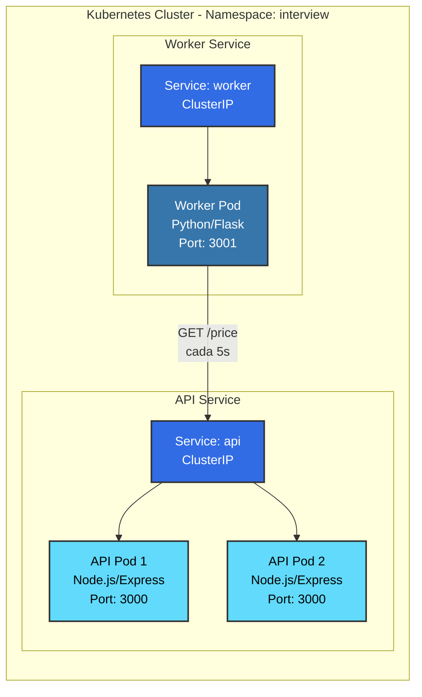

# Bitcoin Price Monitor Platform

Sistema de monitoreo de precios de Bitcoin compuesto por dos servicios: un API que provee precios y un Worker que monitorea alertas.

## Arquitectura

```mermaid
graph LR
    subgraph Kubernetes Cluster - Namespace: interview
        subgraph API Service
            API1[API Pod 1<br/>Node.js/Express<br/>Port: 3000]
            API2[API Pod 2<br/>Node.js/Express<br/>Port: 3000]
            APISVC[Service: api<br/>ClusterIP]
            APISVC --> API1
            APISVC --> API2
        end
        
        subgraph Worker Service
            WORKER[Worker Pod<br/>Python/Flask<br/>Port: 3001]
            WORKERSVC[Service: worker<br/>ClusterIP]
            WORKERSVC --> WORKER
        end
        
        WORKER -->|GET /price<br/>cada 5s| APISVC
    end
    
    style API1 fill:#61dafb,stroke:#333,stroke-width:2px,color:#000
    style API2 fill:#61dafb,stroke:#333,stroke-width:2px,color:#000
    style WORKER fill:#3776ab,stroke:#333,stroke-width:2px,color:#fff
    style APISVC fill:#326ce5,stroke:#333,stroke-width:2px,color:#fff
    style WORKERSVC fill:#326ce5,stroke:#333,stroke-width:2px,color:#fff
```
